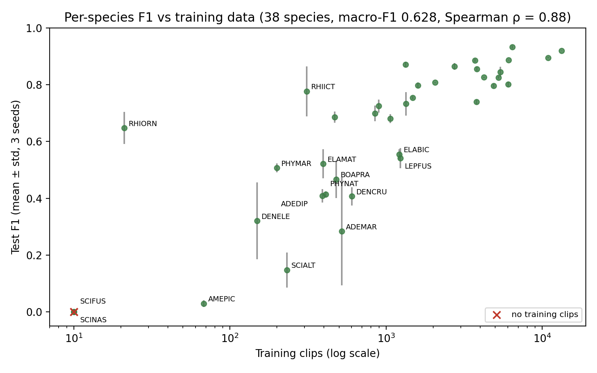
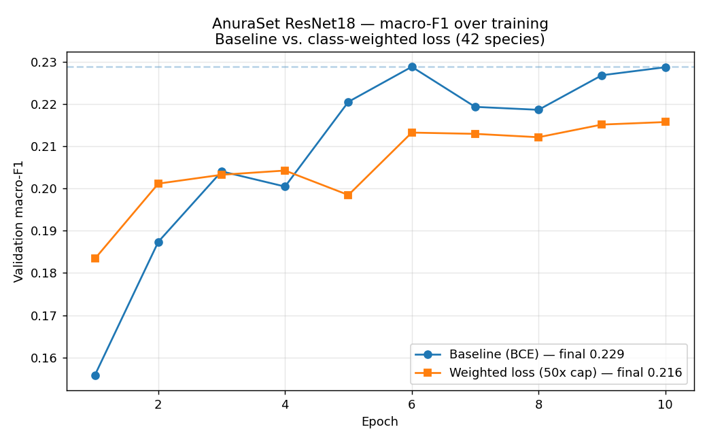

# 🐸 AI Acoustic Frog Classifier

Identifies which of **42 Neotropical frog species** is calling in a 3-second
audio clip, built on the peer-reviewed
**[AnuraSet](https://doi.org/10.1038/s41597-023-02666-2)** benchmark.

**Best result: macro-F1 0.628 ± 0.009** (3 seeds) using frozen Google Perch
embeddings, across the 38 species with test support.

## What this is

Passive acoustic monitoring records the soundscape of an ecosystem, and frogs
are keystone bioindicators — sensitive to habitat degradation, water quality,
and climate shifts — so automatically identifying their calls is directly
useful for biodiversity monitoring. AnuraSet is a hard, realistic benchmark:
93,378 three-second clips across 42 species, with overlapping choruses and a
long-tailed distribution where a few species are common and most are rare.

The task is **multi-label** (several species can call in the same clip), so
performance is measured with **macro-averaged F1**, which weights every species
equally and is therefore dominated by performance on rare species.

## Results

| Run | Features | Macro-F1 | Species |
|---|---|---|---|
| ResNet18 (Cañas et al. 2023) | mel-spectrogram | 0.349 | 42 |
| ResNet50 (Cañas et al. 2023) | mel-spectrogram | 0.332 | 42 |
| ResNet152 (Cañas et al. 2023) | mel-spectrogram | 0.378 | 42 |
| ResNet18, mine (10 epochs) | mel-spectrogram | 0.229 | 42 |
| ResNet18 + class weighting, mine | mel-spectrogram | 0.216 | 42 |
| ResNet50, mine (10 epochs) | mel-spectrogram | 0.223 | 42 |
| **Perch + MLP head** | **frozen embeddings** | **0.628 ± 0.009** | **38** |

Not a strict like-for-like comparison: published figures cover all 42 species,
mine the 38 with test support. My ResNet figures are final-epoch validation
macro-F1 from the training log; those runs are under-trained at 10 epochs on a
free Kaggle GPU and do **not** reproduce the published ResNet numbers.

Threshold choice matters more than expected: the same Perch model scores
**0.343 at a fixed 0.5 threshold** and **~0.68 with per-class tuned
thresholds**. The gain from tuning exceeds the gain from changing the
representation — worth noting when comparing published multi-label results that
don't state their threshold.

## Approach

**Stage 1 — CNN baseline (reproduction attempt).**
`audio → mel-spectrogram + SpecAugment → ResNet18/50 → 42 sigmoid outputs`,
BCE loss, 10 epochs on a Kaggle T4.

**Stage 2 — frozen embeddings (best).**
`audio → Google Perch (frozen) → 1280-d embedding → MLP head → 42 outputs`

- **Head:** LayerNorm → Linear(1280, 512) → GELU → Dropout(0.3) → Linear(512, 42)
- **Loss:** focal BCE (γ=2) with capped positive weighting
- **Augmentation:** mixup (β=0.4) applied to embeddings
- **Thresholds:** per-class, tuned on held-out training recordings

## Evaluation

- Official AnuraSet train/test `subset` column
- **Leakage verified:** 0 of 1074 train and 538 test parent recordings shared.
  The authors split at the 1-minute recording level by design; this confirms the
  preprocessed mirror preserved that.
- Thresholds tuned on 15% of *training* recordings, never on test
- 3 seeds, mean ± std reported

## Experiment: does class weighting help the CNN?

Rare species score far worse than common ones (the paper reports 68.4% F1 on
frequent species vs 15.7% on rare). I implemented per-species positive weights
inversely proportional to frequency, capped at 50×, and retrained ResNet18
under identical conditions.

**Finding:** aggressive static reweighting slightly *reduced* macro-F1
(0.229 → 0.216). Prioritising rare species traded away accuracy on common
species faster than it gained on rare ones. A legitimate negative result: the
obvious fix for imbalance didn't improve the aggregate metric.

## Limitations

- **2 of the 38 test-supported species (SCIFUS, SCINAS) have zero training
  clips** and score 0 F1 by construction. Over the 36 learnable species,
  macro-F1 is 0.662. The headline 0.628 includes them.
- Perch expects 5s at 32 kHz; AnuraSet clips are 3s at 22.05 kHz, so clips are
  upsampled and zero-padded and 40% of each input window is silence. Windowing
  is the most obvious untried improvement.
- Per-species F1 correlates strongly with training volume (Spearman ρ = 0.88),
  reproducing the central finding of the original paper.
- Data volume isn't everything: RHIORN reaches 0.65 F1 on ~20 clips, ADEMAR
  0.28 on ~500. Call distinctiveness matters.
- My ResNet runs are under-trained and shouldn't be read as a reproduction.
- Single dataset, 4 sites, untested on unseen sites — the deployment case that
  actually matters.
- Uses a preprocessed Kaggle mirror, not the official Zenodo release
  (10.5281/zenodo.8056090).

## Relation to prior work

This is a **reproduction and extension**, not a new result. Kath et al. (2024)
showed linear classifiers on BirdNET embeddings beat the AnuraSet CNN baseline;
Ghani et al. (2023) showed Perch embeddings transfer well to non-bird taxa
including anurans. This repo applies a newer embedding model with per-class
threshold tuning and explicit leakage verification, and quantifies how much of
the gain comes from thresholding rather than representation.

## What I'd try next

- Proper 5s windows instead of zero-padding 3s clips
- BirdNET vs Perch embeddings under this identical protocol
- Aggregating clip predictions to site-level species richness — the output an
  ecologist or investor would actually use

## Reproducing

Full pipeline in
[`ai-acoustic-frog-classifier.ipynb`](ai-acoustic-frog-classifier.ipynb), runs
end-to-end on a free Kaggle GPU session:

1. Attach the preprocessed AnuraSet data as a Kaggle dataset
2. Run the setup cells (clone
   [soundclim/anuraset](https://github.com/soundclim/anuraset), install
   dependencies, fix metadata paths)
3. Run the embedding + head cells (~15 min for embeddings, ~2 min per seed)

Per-species results: [`per_species_f1.csv`](per_species_f1.csv)

Note: the current notebook contains the Perch pipeline and the ResNet50 run.
The ResNet18 baseline and class-weighting runs were from an earlier session and
are reported here from their training logs.

## Credits & license

Built on **AnuraSet**:

> Cañas, J.S., Toro-Gómez, M.P., Sugai, L.S.M. et al. *A dataset for
> benchmarking Neotropical anuran calls identification in passive acoustic
> monitoring.* Sci Data 10, 771 (2023).
> https://doi.org/10.1038/s41597-023-02666-2

Also referenced:
- Kath et al. (2024), *Ecological Informatics* 82:102710
- Ghani et al. (2023), *Scientific Reports* 13:22876

Dataset CC0. Baseline code (soundclim/anuraset) MIT. This repository MIT.
